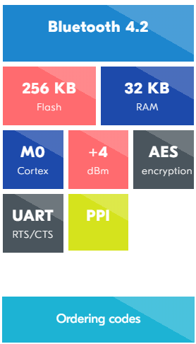
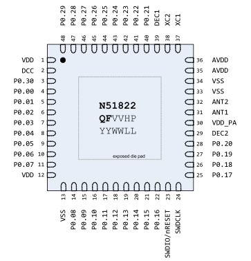

# [nRF51822](https://github.com/sochub/nRF51822) 

 

#### 父级：[Nordic](https://github.com/sochub/Nordic) 

#### 归属：[cortex M0](https://github.com/sochub/CM0)

### [nRF51822简介](https://github.com/sochub/nRF51822/wiki)

[NRF51822](https://www.nordicsemi.com/Products/Low-power-short-range-wireless/nRF51822) 是普及度非常高的BLE SoC

Cortex™ M0 + 256kB(/128kB) flash + 16kB RAM

 

### [收录资源](https://github.com/sochub/nRF51822)

* [参考文档](docs/)
* [参考资源](src/)
* [demo工程](demo/)

官方资源下载 [SDK](https://www.nordicsemi.com/Software-and-Tools/Software/nRF5-SDK)

#### [硬件设计资源](https://github.com/sochub/nRF51822)

封装：QFN48 (QFAC) 

  

* [Eagle资源](src/Eagle)
* [kicad资源](src/kicad)

### [选型建议](https://github.com/sochub/nRF51822)

[nRF51822](https://github.com/sochub/nRF51822)市场竞争对手为TI的[CC2540](https://github.com/sochub/CC2540)，都是同代产品支持BLE 4.0，后者基于8051内核。

对于片上资源升级和BLE 5.0升级替换，可选[nRF52832](https://github.com/sochub/nRF52832)或[CC2640](https://github.com/sochub/CC2640)，当然新入局的国产WCH的[CH578](https://github.com/sochub/CH578)也可以考虑下。

##  [SoC资源平台](http://www.qitas.cn)  
